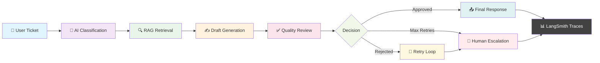
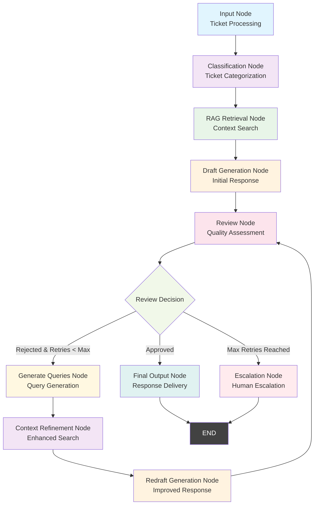

# 🤖 Support Agent System

<div align="center">


[](https://opensource.org/licenses/MIT)
[](https://www.python.org/downloads/)
[](https://nodejs.org/)

</div>

---

<div align="center">

### 🚀 **Intelligent AI-Powered Support Ticket Management**

**Built with LangGraph, React, and LangSmith Integration**

*Automated response generation • Multi-stage workflow • Visual development • Full tracing*

</div>

---

## 📋 **About This Project**

A comprehensive AI-powered support ticket management system that leverages the latest in LLM technology and workflow orchestration. This system automatically processes support tickets through an intelligent multi-stage pipeline, providing accurate responses while maintaining full transparency through LangSmith tracing and visual development tools.

### **What Makes It Special:**
- 🤖 **AI-First Approach**: Uses Groq LLM for high-performance response generation
- 🔄 **Intelligent Workflow**: Multi-stage processing with automatic retry and escalation logic
- 📊 **Full Transparency**: Complete workflow tracing and performance monitoring
- 🎨 **Visual Development**: LangGraph Studio for intuitive workflow design
- ⚡ **Real-time Processing**: Asynchronous ticket processing with live status updates

---


## 📊 **System Overview**

<div align="center">



</div>

---

## 🎯 **Key Features**

<div align="center">

| 🧠 **AI Processing** | 🔄 **Workflow** | 📊 **Monitoring** | 🛠️ **Development** |
|---------------------|-----------------|------------------|-------------------|
| Groq LLM Integration | Multi-stage Pipeline | LangSmith Tracing | LangGraph Studio |
| Intelligent Classification | Retry Logic | Performance Analytics | Visual Debugging |
| RAG Document Retrieval | Escalation Management | Real-time Monitoring | Auto-generated Docs |

</div>

---

## 🚀 Features

### Core Functionality
- **Intelligent Ticket Processing**: AI-powered classification and response generation using Groq LLM
- **Document Upload & Management**: PDF document upload with category-based organization
- **RAG (Retrieval-Augmented Generation)**: Context-aware response generation using FAISS vector embeddings
- **Multi-stage Workflow**: LangGraph-based workflow with classification, retrieval, generation, and review stages
- **Escalation Management**: Automatic escalation for complex tickets with retry logic
- **Real-time Processing**: Asynchronous ticket processing with status tracking
- **LangSmith Integration**: Comprehensive workflow tracing and performance monitoring
- **LangGraph Studio**: Visual workflow development and debugging interface

### Frontend Features
- **Modern UI**: Built with React, Tailwind CSS, and Framer Motion
- **Responsive Design**: Mobile-friendly interface with collapsible sidebar
- **File Upload**: Drag-and-drop PDF upload with progress tracking
- **Ticket Management**: Submit tickets and view processing reports
- **Real-time Updates**: Live status updates and processing history
- **LangGraph SDK Integration**: Direct interaction with LangGraph workflows

### Backend Features
- **LangGraph CLI**: Development server with `langgraph dev` and `langgraph dev --allow-blocking`
- **LangGraph Studio**: Automatically opens in browser for visual workflow development
- **LangSmith Integration**: Comprehensive workflow tracing and performance monitoring
- **Vector Database**: FAISS-based document storage and retrieval
- **Multi-stage Workflow**: Complex processing pipeline with retry logic and escalation
- **Docker Support**: Containerized deployment with `langgraph build` and `langgraph up`
- **API Documentation**: Auto-generated OpenAPI docs at `http://localhost:2024/docs`


## 🏗️ Architecture

### System Overview
```
┌─────────────────┐    ┌─────────────────┐    ┌─────────────────┐
│   Frontend      │    │   Backend       │    │   AI Services   │
│   (React)       │◄──►│   (LangGraph)   │◄──►│   (LangSmith)   │
│                 │    │                 │    │                 │
│ • Ticket Submit │    │ • LangGraph CLI │    │ • Workflow      │
│ • File Upload   │    │ • LangGraph     │    │   Tracing      │
│ • Reports       │    │   Studio        │    │ • Performance   │
│ • LangGraph SDK │    │ • Vector Store  │    │   Analytics    │
└─────────────────┘    └─────────────────┘    └─────────────────┘
```

### Workflow Pipeline
1. **Input Processing**: Ticket submission and validation
2. **Classification**: AI-powered ticket categorization
3. **RAG Retrieval**: Context retrieval from document store
4. **Draft Generation**: Initial response generation
5. **Review**: Quality assessment and decision making
6. **Refinement**: Query generation and context refinement (if needed)
7. **Final Output**: Response delivery or escalation

### Graph Visualization


### Node Descriptions

#### **Input Node** 🔵
- **Purpose**: Initial ticket processing and validation
- **Function**: Receives ticket data (subject, description) and validates input
- **Output**: Creates initial state with ticket information and empty message history

#### **Classification Node** 🟣
- **Purpose**: AI-powered ticket categorization
- **Function**: Analyzes ticket content to determine category (billing, technical, general, etc.)
- **Output**: Categorized ticket with confidence score and category-specific processing flags

#### **RAG Retrieval Node** 🟢
- **Purpose**: Context-aware document retrieval
- **Function**: Searches vector database for relevant documents based on ticket category and content
- **Output**: Retrieved context documents with relevance scores for response generation

#### **Draft Generation Node** 🟡
- **Purpose**: Initial response generation
- **Function**: Uses LLM to generate response based on ticket content and retrieved context
- **Output**: First draft response with confidence metrics

#### **Review Node** 🩷
- **Purpose**: Quality assessment and decision making
- **Function**: Evaluates draft quality, checks for completeness, accuracy, and helpfulness
- **Output**: Review decision (approved/rejected) with feedback for improvements

#### **Generate Queries Node** 🟡
- **Purpose**: Query generation for context refinement
- **Function**: Creates specific search queries based on review feedback to find better context
- **Output**: Targeted search queries for improved document retrieval

#### **Context Refinement Node** 🟣
- **Purpose**: Enhanced context retrieval
- **Function**: Uses generated queries to search for more relevant documents
- **Output**: Refined context with higher relevance scores

#### **Redraft Generation Node** 🟡
- **Purpose**: Improved response generation
- **Function**: Generates new response using refined context and review feedback
- **Output**: Improved draft response with better quality metrics

#### **Escalation Node** 🔴
- **Purpose**: Human escalation for complex cases
- **Function**: Triggers when max retries reached or system errors occur
- **Output**: Escalation record with reason and human agent assignment

#### **Final Output Node** 🟢
- **Purpose**: Response delivery
- **Function**: Formats and delivers approved response to user
- **Output**: Final response with processing metadata and audit trail

## 📁 Project Structure

```
job application test project/
├── backend/                    # FastAPI backend
│   ├── data/                   # Data storage
│   ├── src/
│   │   ├── config/            # Configuration settings
│   │   ├── data/              # PDF documents
│   │   ├── embed_model/       # Sentence transformer model
│   │   ├── prompts/           # LLM prompts
│   │   ├── services/          # Core services
│   │   ├── utils/             # Utilities
│   │   └── workflow/          # LangGraph workflow
│   ├── main.py                # FastAPI application
│   ├── requirements.txt       # Python dependencies
│   └── Dockerfile            # Docker configuration
├── frontend/                   # React frontend
│   ├── src/
│   │   ├── components/        # React components
│   │   ├── services/          # API services
│   │   └── utils/             # Frontend utilities
│   ├── package.json           # Node.js dependencies
│   └── tailwind.config.js    # Tailwind CSS config

```

## 🛠️ Technology Stack

### Backend
- **FastAPI**: Modern Python web framework
- **LangGraph**: Workflow orchestration
- **LangChain**: LLM integration
- **FAISS**: Vector similarity search
- **Sentence Transformers**: Text embeddings
- **Pydantic**: Data validation
- **Uvicorn**: ASGI server

### Frontend
- **React 18**: UI framework
- **Tailwind CSS**: Utility-first CSS
- **Framer Motion**: Animation library
- **React Hook Form**: Form handling
- **React Dropzone**: File upload
- **Headless UI**: Accessible components
- **LangGraph SDK**: Direct workflow interaction

### AI/ML
- **Groq**: High-performance LLM provider for response generation
- **Sentence Transformers**: Text embeddings for RAG retrieval
- **LangChain**: LLM orchestration and workflow management
- **LangSmith**: Workflow tracing, debugging, and performance analytics

## 🚀 Quick Start

### Prerequisites
- Python 3.11+
- Node.js 18+
- Docker (optional)
- LangGraph CLI (`pip install langgraph-cli`)
- Groq API key
- LangSmith API key (for tracing)

### Backend Setup

1. **Clone the repository**
   ```bash
   git clone https://github.com/bilalsxadad1231231/customer-support-ticket-agent.git
   cd customer-support-ticket-agent
   ```

2. **Navigate to backend directory**
   ```bash
   cd backend
   ```

3. **Create virtual environment**
   ```bash
   python -m venv venv
   # On Windows
   venv\Scripts\activate
   # On macOS/Linux
   source venv/bin/activate
   ```

4. **Install dependencies**
   ```bash
   pip install -r requirements.txt
   ```

5. **Set up environment variables**
   Create a `.env` file in the backend directory (see Environment Variables section below for details).

6. **Run the backend server**
   ```bash
   # Using LangGraph CLI for development
   langgraph dev
   
   # Or with blocking operations allowed
   langgraph dev --allow-blocking
   ```

   The LangGraph API will be available at `http://localhost:2024`
   - API Documentation: `http://localhost:2024/docs`
   - Graph Visualization: `http://localhost:2024/graphs`
   - **LangGraph Studio**: Automatically opens in your browser at the LangChain platform

### Frontend Setup

1. **Navigate to frontend directory**
   ```bash
   cd frontend
   ```

2. **Install dependencies**
   ```bash
   npm install
   ```

3. **Start the development server**
   ```bash
   npm start
   ```

   The frontend will be available at `http://localhost:3000`


## 📖 API Endpoints

### LangGraph Workflow Endpoints
- `POST /support_agent/invoke` - Process support tickets through the workflow
- `GET /support_agent/stream` - Stream processing updates in real-time
- `GET /support_agent/config` - Get workflow configuration
- `GET /graphs` - View available graphs and their structure

### LangGraph Studio Integration
- **Automatic Launch**: LangGraph Studio automatically opens in your browser when you start the server
- **Platform Access**: Studio is available through the LangChain platform interface
- **Visual Development**: Edit and debug workflows through the web interface
- **Real-time Monitoring**: View workflow execution and traces in real-time

### Additional Endpoints
- `POST /upload` - Upload PDF documents with category (if implemented)
- `GET /escalation-log` - Retrieve escalation history (if implemented)
- `GET /health` - Health check endpoint

## 🔧 Configuration

### Backend Configuration
The backend uses a modular configuration system in `src/config/settings.py`:

- **LLM Configuration**: Groq API settings with tracing enabled
- **LangChain Tracing**: LangSmith integration for workflow monitoring
- **Vector Store**: FAISS index configuration
- **Workflow**: LangGraph node settings with retry limits
- **Logging**: Application logging configuration

### LangSmith Project Tracking
The project is configured with LangSmith for comprehensive workflow monitoring:

- **Trace Monitoring**: All workflow executions are traced and logged
- **Performance Analytics**: Track execution times and success rates
- **Debugging**: Detailed step-by-step execution logs
- **Project Dashboard**: View all traces at [LangSmith Dashboard](https://smith.langchain.com/)
- **Custom Metrics**: Monitor retry counts, escalation rates, and response quality

### Frontend Configuration
- **LangGraph SDK**: Configured in `src/services/agentService.js` for direct workflow interaction
- **API Base URL**: Set to LangGraph server at `http://localhost:2024`
- **Tailwind CSS**: Custom theme in `tailwind.config.js`

## 📊 Usage Examples

### Uploading Documents
1. Navigate to the frontend application
2. Select "Submit Ticket" tab
3. Choose a category (e.g., "billing", "general")
4. Upload PDF documents using drag-and-drop
5. Submit to process documents

### Processing Tickets
1. Fill in the ticket form with subject and description
2. Submit the ticket for AI processing
3. Monitor the processing status in real-time
4. View the generated response or escalation decision

## 🔍 Development

### Backend Development
- **Adding new workflows**: Extend `src/workflow/graph.py`
- **Modifying workflow nodes**: Update `src/workflow/nodes.py`
- **Adding prompts**: Create new files in `src/prompts/`
- **LangGraph CLI**: Use `langgraph dev` for development server
- **LangGraph Studio**: Automatically opens in browser when server starts
- **LangGraph Build**: Use `langgraph build -t image-name` for Docker image creation
- **LangGraph Deploy**: Use `langgraph up --image image-name --wait --port 2024` for deployment

### LangSmith Development Tools
- **Trace Analysis**: Use LangSmith dashboard to analyze workflow performance
- **Debug Workflows**: Step through execution traces to identify issues
- **Performance Comparison**: Compare different workflow configurations
- **Custom Metrics**: Track business-specific metrics like resolution time
- **Collaboration**: Share traces with team members for debugging

### Frontend Development
- **Adding components**: Create new files in `src/components/`
- **Styling**: Use Tailwind CSS classes
- **State management**: Use React hooks and context
- **LangGraph SDK**: Use `@langchain/langgraph-sdk` for workflow interaction

### Workflow Development
The LangGraph workflow can be extended by:
1. Adding new nodes in `src/workflow/nodes.py`
2. Defining edges in `src/workflow/edges.py`
3. Updating the graph structure in `src/workflow/graph.py`


## 🐳 Docker Deployment

### Build LangGraph Docker Image
```bash
# Navigate to backend directory
cd backend

# Build using LangGraph CLI (recommended)
langgraph build -t my-agent-image

# Or build with specific configuration file
langgraph build --config langgraph.json -t my-agent-image

# Build with custom image name
langgraph build -t support-agent-backend
```

### Build Traditional Docker Image
```bash
# Alternative: Build using Docker directly
cd backend
docker build -t support-agent-backend .
```

### Run LangGraph Container
```bash
# Run the built LangGraph image
langgraph up --image my-agent-image --wait --port 2024

# Or run with Docker Compose
docker-compose up -d

# Or run traditional Docker container
docker run -p 2024:2024 support-agent-backend
```

### LangGraph Build Configuration
The `langgraph.json` file contains build configuration:
- **App Configuration**: Points to the main FastAPI app
- **Graph Configuration**: Defines the LangGraph workflow
- **Dependencies**: Specifies required packages and versions
- **Environment**: Sets up runtime environment variables

## 📝 Environment Variables

### Backend (.env)
```env
# LLM Provider API Key
GROQ_API_KEY=your_groq_api_key_here

# LangChain Configuration
LANGCHAIN_API_KEY=your_langchain_api_key_here
LANGCHAIN_PROJECT=your_project_name
LANGCHAIN_TRACING_V2=true
LANGCHAIN_ENDPOINT=https://api.smith.langchain.com
```

**Required API Keys:**
- **GROQ_API_KEY**: Get your API key from [Groq Console](https://console.groq.com/)
- **LANGCHAIN_API_KEY**: Get your API key from [LangSmith](https://smith.langchain.com/)
- **LANGCHAIN_PROJECT**: Your LangSmith project name for tracing

### Frontend (.env)
```env
REACT_APP_LANGGRAPH_URL=http://localhost:2024
```

## 🤝 Contributing

1. Fork the repository
2. Create a feature branch
3. Make your changes
4. Add documentation if applicable
5. Submit a pull request

## 📄 License

This project is licensed under the MIT License - see the LICENSE file for details.

## 🆘 Support

For support and questions:
- Check the LangGraph API documentation at `http://localhost:2024/docs`
- View graph visualization at `http://localhost:2024/graphs`
- **LangGraph Studio**: Automatically opens in browser when you start the server
- Monitor workflow traces in LangSmith at `https://smith.langchain.com/`
- Review the workflow logs in `support_agent.log`
- Open an issue in the repository

### Debugging Resources
- **LangSmith Traces**: Detailed execution logs for each workflow run
- **LangGraph Studio**: Visual workflow editor and debugger (auto-opens in browser)
- **Graph Visualization**: Interactive graph structure viewer
- **API Documentation**: Auto-generated OpenAPI documentation

## 🔄 Updates and Maintenance

### Regular Maintenance
- Update dependencies regularly
- Monitor API usage and performance
- Review and update prompts as needed
- Backup vector store indexes
- Rebuild Docker images when updating LangGraph configuration
- Monitor LangSmith traces for performance optimization

### Scaling Considerations
- Use Redis for session management
- Implement database for persistent storage
- Add load balancing for high traffic
- Consider cloud deployment options 
